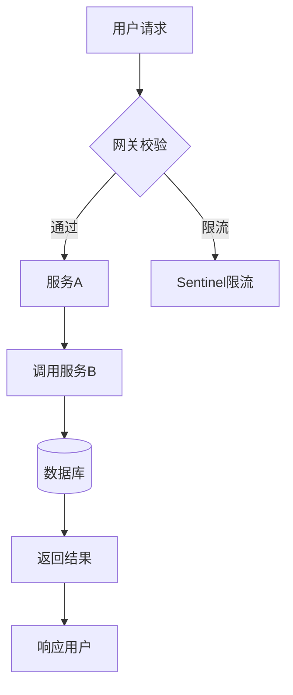
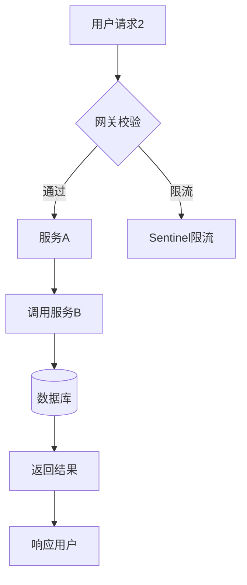

## 1️⃣ 流程图 Demo
## 流程图1

```mermaid
flowchart TD
    A[用户请求] --> B{网关校验}
    B -->|通过| C[服务A]
    B -->|限流| D[Sentinel限流]
    C --> E[调用服务B]
    E --> F[(数据库)]
    F --> G[返回结果]
    G --> H[响应用户]
```

## 流程图2

```mermaid
flowchart TD
    A[用户请求2] --> B{网关校验}
    B -->|通过| C[服务A]
    B -->|限流| D[Sentinel限流]
    C --> E[调用服务B]
    E --> F[(数据库)]
    F --> G[返回结果]
    G --> H[响应用户]
```